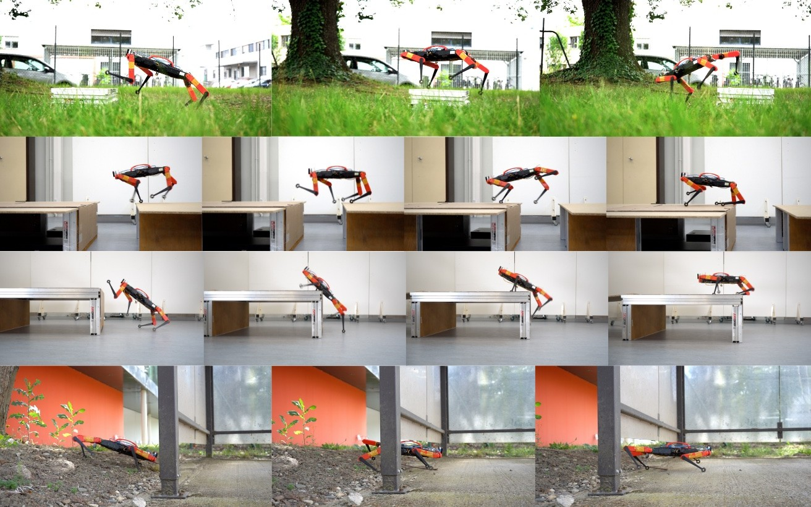

# SoloParkour: Constrained Reinforcement Learning for Visual Locomotion from Privileged Experience



> [SoloParkour: Constrained Reinforcement Learning for Visual Locomotion from Privileged Experience](https://gepetto.github.io/SoloParkour/)  
>  Elliot Chane-Sane*, Joseph Amigo*, Thomas Flayols, Ludovic Righetti, Nicolas Mansard,  
> **CoRL 2024**  


## Usage

1. Train the privileged (Stage 1) policy:
```bash
python train.py task=SoloParkour headless=True task.env.control.damping_curriculum.enable=True
```

2. Generate the dataset of privileged experience:
```bash
# replace with the correct path to the privileged policy weights
policy_path=path/to/cleanrl_model.pt

python train.py task=SoloParkour train=SoloParkourDDPG_demos_generate headless=True task.env.numEnvs=256 task.env.enableCameraSensors=True task.env.depth.use_depth=True task.env.terrain.maxInitMapLevel=9 train.params.config.target_policy_path=${policy_path}
```

3. Train the visual (Stage 2) policy from privileged experience:
```bash
# replace with the correct path to the privileged experience folder
demo_path=path/to/folder/ # folder which contains rb_demos.pkl

python train.py task=SoloParkour train=SoloParkourDDPG_demos_rnn_vision headless=True task.env.numEnvs=256 task.env.enableCameraSensors=True task.env.depth.use_depth=True train.params.config.demos_rb_path=${demo_path}
```

## Installation

```bash
conda create -n IsaacGymEnvs python=3.8
conda activate IsaacGymEnvs

conda install pip
conda install -c conda-forge ninja

# Download Isaac Gym: https://developer.nvidia.com/isaac-gym 
cd path/to/isaacgym/python && pip install --user --no-cache-dir -e . 

# Clone IsaacGymEnvs: https://github.com/isaac-sim/IsaacGymEnvs
cd path/to/IsaacGymEnvs/ && pip install --user --no-cache-dir  -e .

pip uninstall torch tochvision
pip install --user --no-cache-dir torch==2.2.0 torchvision==0.17.0
# Fix compability problem with numpy version
pip install --user --no-cache-dir "numpy<1.24"
pip install --user --no-cache-dir texttable av

# Add correct LD_LIBRARY_PATH on env start
conda env config vars set LD_LIBRARY_PATH=$LD_LIBRARY_PATH:$CONDA_PREFIX/lib --name $CONDA_DEFAULT_ENV
```

### Acknowledgements

This code was based on the following repositories:
- https://github.com/vwxyzjn/cleanrl
- https://github.com/isaac-sim/IsaacGymEnvs
- https://github.com/gepetto/constraints-as-terminations

### Citation

```
@inproceedings{chanesane2024solo,
    title = {SoloParkour: Constrained Reinforcement Learning for Visual Locomotion from Privileged Experience},
    author = {Elliot Chane-Sane and Joseph Amigo and Thomas Flayols and Ludovic Righetti and Nicolas Mansard},
    booktitle = {Conference on Robot Learning (CoRL)},
    year = {2024},
}
```
